% That SQL looks pretty complicated. Where are the tests?
% James E. Marca
% 2016-04-20

# Overview

* Database tables are super useful
* But they can get a little messy
* and the SQL used to create them can get complex


# Motivation: Clean up and test SQL

--------

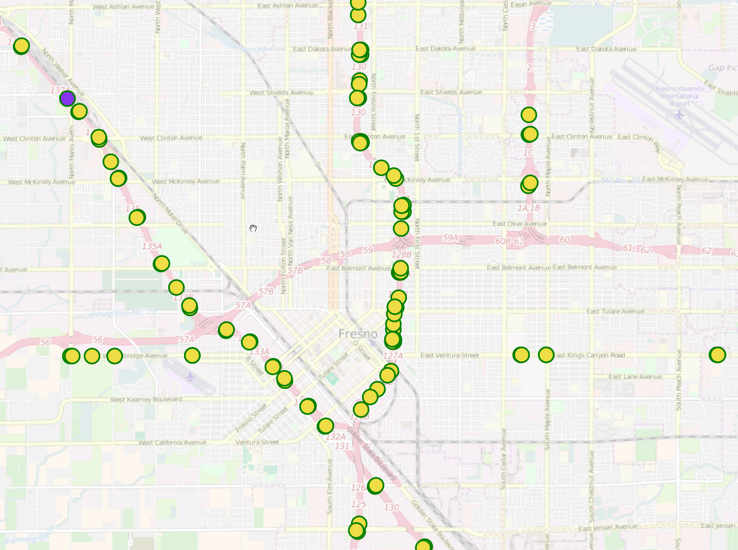


--------

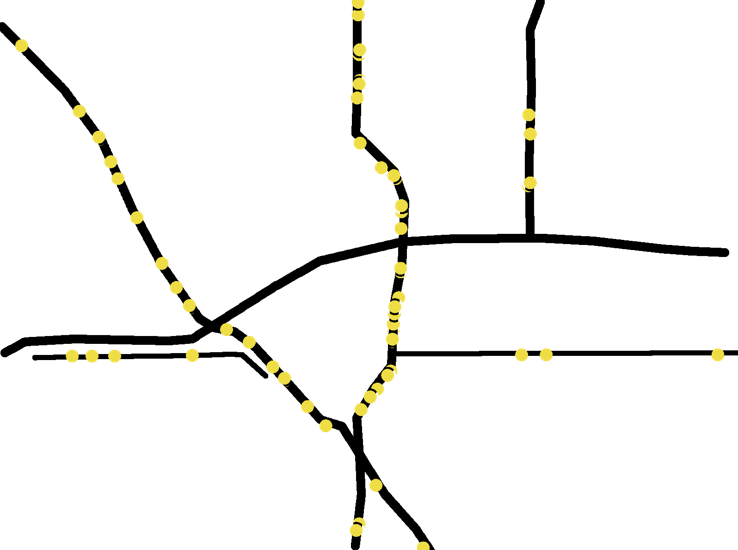


# To segmentize the points


# I wrote this SQL

```sql
INSERT INTO osm_upgrade.vds_segment_geometry
   (vds_id,adj_pm,refnum,direction,seggeom)
SELECT vds_id,adj_pm,refnum,direction,seggeom
FROM (
  SELECT pdist,ptsec,ndist,vds_id,adj_pm,refnum,
         relation_direction as direction,
         -- vdsid, order, freeway id, freeway dir

         -- AND the computed segment geometry associated with the vds
         CASE WHEN ptsec <= ntsec

-- The previous vds comes before the next.
-- Create a line segment by taking the piece of the
-- route line between ptsec and ntsec

              THEN ST_line_substring( q.rls, ptsec,ntsec )

              ELSE

-- The "previous" vds comes /after/ the
-- "next". Probably this means that they are pointing
-- at different line segments.  Hardcode to zero or one

                    case
                      WHEN mydist > pdist then ST_line_substring( q.rls, ptsec, 1 )
                      WHEN mydist < pdist then ST_line_substring( q.rls, 0, ntsec )
                    end
            END AS seggeom
       FROM
       (

-- here we select the points halfway between a target vds and the
-- vds's on either side of it (p=previous,n=next) along the route.  The
-- points are specified as the distance along the route linestring.

         SELECT vrr.vds_sequence_id AS sequence_id,
                vrr.vds_id,vrr.adj_pm,vrr.refnum,vrr.relation_direction,
                -- vdsid,pm, and osm relation
                vrr.line AS rls,        -- the linestring the vds snaps to
                vrr.dist as mydist,
                vrr.numline AS myline,  -- to which multilines are we snapped?
                p.dist AS pdist,      -- the distance along the
                                      -- line of the previous vds
                CASE WHEN p.dist IS NOT NULL   -- this computes the bisection
                     THEN (vrr.dist+p.dist)/2  -- distance between the previous
                     ELSE 0                    -- and target vds
                     END AS ptsec,
                n.dist AS ndist,      -- the distance along the
                                      -- line of the next vds
                CASE WHEN n.dist IS NOT NULL   -- this computes the bisection
                     THEN (vrr.dist+n.dist)/2  -- distance between the target
                     ELSE 1                    -- and next vds
                     END AS ntsec

            FROM osm_upgrade.vds_route_relation vrr
                 -- joining the previous vdsid
                 LEFT JOIN osm_upgrade.vds_route_relation p
                      ON ( vrr.vds_sequence_id=p.vds_sequence_id+1 AND
                           vrr.refnum=p.refnum AND
                           vrr.relation_direction=p.relation_direction AND
                           vrr.numline=p.numline)
                 -- and joining the next vdsid
                 LEFT JOIN osm_upgrade.vds_route_relation n
                      ON ( n.vds_sequence_id=vrr.vds_sequence_id+1 AND
                           vrr.refnum=n.refnum AND
                           vrr.relation_direction=n.relation_direction AND
                           vrr.numline=n.numline)

                 -- We need to the route line too as all our
                 -- computations are based upon that
                 LEFT JOIN tempseg.numbered_route_lines rl
                      ON (rl.refnum=vrr.refnum AND
                          vrr.relation_direction=rl.direction)
                 -- WHERE
                 -- rl.refnum=99 and rl.direction='north'
                 -- rl.refnum=580
            ORDER BY vrr.vds_sequence_id
       ) q
       ORDER BY sequence_id
) qq WHERE geometrytype(seggeom) !~* 'point'
;
```
... and several other files of similar functions.

--------


# Talk objectives

* Give real-world examples of using pgTAP and Sqitch
    1. Cleaning up after a minor SQL disaster
    2. Modularizing, testing, and porting that monstrous SQL mapping hack

* Hoping others can learn from my mistakes.


# About me

* James Marca
* Transportation Researcher at UC\ Irvine
* Activimetrics LLC
* twitter @jmarca
* github https://github.com/jmarca


# My PostgreSQL experience

* Ever since 2001 (ish)
* Needed a geo-enabled DB
* MySQL didn't at the time
* PostgreSQL had PostGIS
* Application: storing & processing streaming GPS data


# Acknowlegments

Shout out to the agencies funding our work over the years

# Caltrans
## DRI/SI and District 12

Mission: Provide a safe, sustainable, integrated and efficient
transportation system to enhance California's economy and livability.

# California Air Resources Board

Mission: To promote and protect public health, welfare and ecological
resources through the effective and efficient reduction of air
pollutants while recognizing and considering the effects on the
economy of the state.


# Context

# CalVAD: California Vehicle Activity Database

Estimate, from data, vehicle movements on state roads and highways

# Input data sources

* 10,000+ inductive loop detectors (VDS)
* 100+ Weigh In Motion (WIM) stations
* Estimated annual vehicle counts on every street

----------

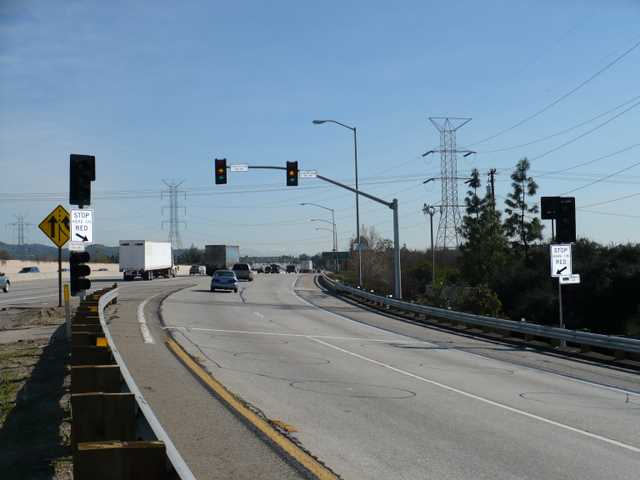


----------

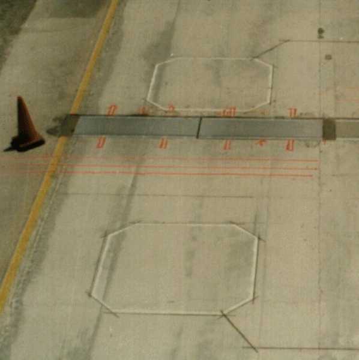

----------

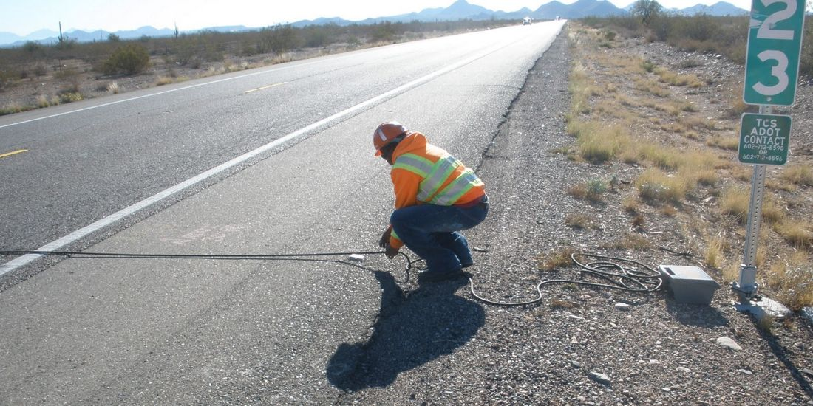


# Part 1: SQL disaster


# The original project (2003)

* Q: "Can you display our safety model results on a map?"
* A: "Sure"

# Simple solution

* Put the VDS data into PostgreSQL
* Use PostGIS to make Point geometries
* Show the points as a layer on a web map
* Wire up "click" to call up modeling results

# Simple solution

* Put the VDS data into PostgreSQL
* Use PostGIS to make Point geometries
* ~~Show the points as a layer on a web map~~
* ~~Wire up "click" to call up modeling results~~


# VDS Loop Metadata

```csv
ID,       Fwy,  Dir, District, County, City,  State_PM, Abs_PM, Latitude,  Longitude,   Length, Type, Lanes,    Name,    User_ID_1, User_ID_2, User_ID_3, User_ID_4
1201044,  133,  S,     12,      59,    36770,  9,        8.991, 33.66184,  -117.7553,     ,      OR,    1,   BARRANCA2,    565,,,
1201052,  133,  S,     12,      59,    36770,  9,        8.991, 33.66184,  -117.7553,     ,      FR,    1,   BARRANCA 2,   565,,,
1201054,  133,  S,     12,      59,    36770,  9,        8.991, 33.66184,  -117.7553,   2.685,   ML,    3,   BARRANCA2,    565,,,
1201058,  133,  N,     12,      59,    36770,  8.866,    8.857, 33.659542, -117.756294,   ,      OR,    1,   BARRANCA1,    551,,,
...
```

# VDS loop detector tables

1. Loop detector metadata
2. Loop detector geometry in SRID 4269 (original)
3. Loop detector geometry in SRID 4326 (for Google Maps)
4. Join tables


--------

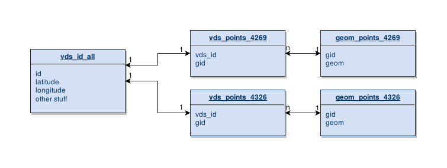

# Load up using perl

* Parse the CSV metadata file
* For each detector
    * find or create entry in `vds_id_all`
    * find or create entry in `geom_points_4269`
    * use PostGIS to transform geometry for `geom_points_4326`
    * make the join table entries


----

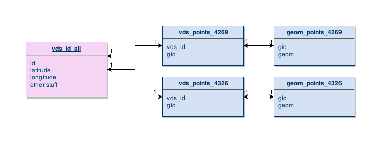

``` {.perl}
my $vds = $self->get_vds_or_die($pk,$data);
```

----

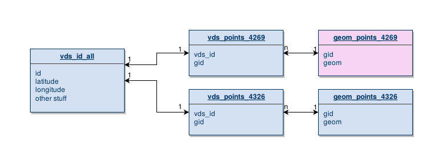

``` {.perl}
my $new_geoid = $self->get_new_geoid;
my $gid        = $new_geoid->gid;
my $creategeom = $self->create_geompoint_4269($lon,$lat,$gid);
```

----

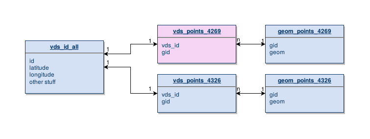

``` {.perl}
$self->join_geom($vds,$gid,4269);
```

----

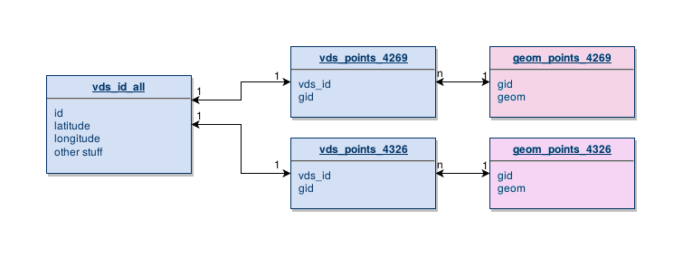

``` {.perl}
$new_geoid = $self->get_new_geoid();
my $projectedgid        = $new_geoid->gid;
my $projectedpoint = $self->project_geom_4326($gid,$projectedgid);
```

------

```{.perl .tall}
method project_geom_4326(Int $gid4269,Int $gid4326){
    my $transform;
    my $test_eval = eval {
        my $arr = [q{ST_AsText(ST_Transform(me.geom,4326))}];
        ($transform) = $self->resultset('Public::GeomPoints4269')->search(
            { 'gid' => $gid4269 },
            {
                select => [ 'gid', \$arr ],
                as => [qw/gid  wkt_transform /],
            },
            );
    };
    if ($EVAL_ERROR) {    # find or create failed
        carp "can't fetch transform $EVAL_ERROR";
        croak;
    }
    my $projectedpoint;
    $test_eval = eval {
        my $arr = [
            q{ST_GeometryFromText(?,4326)},
            ['dummy'=>$transform->get_column('wkt_transform')]
            ];
        $projectedpoint = $self->resultset('Public::GeomPoints4326')->create(
            {
                gid  => $gid4326,
                geom => \$arr,
            }
            );
    };
    if ($EVAL_ERROR) {    # find or create failed
        carp "can't create new tranformed geometry $EVAL_ERROR";
        croak;
    }
    return $projectedpoint;
}
```

----

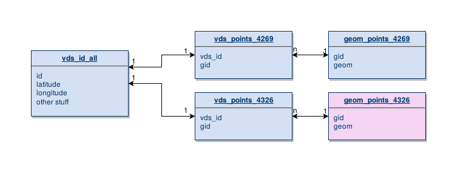

``` {.perl}
$new_geoid = $self->get_new_geoid();
my $projectedgid        = $new_geoid->gid;
my $projectedpoint = $self->project_geom_4326($gid,$projectedgid);
```

----

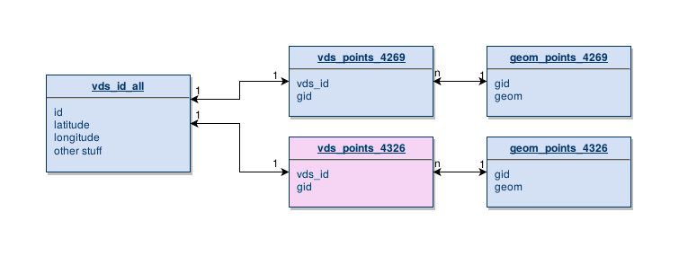

``` {.perl}
$self->join_geom($vds,$projectedgid,4326);
```

# Years go by

-----


-----


# 2010 CalVAD project

# Add Weigh-In-Motion stations

* About 150 WIM stations
* Similar approach as with VDS sites
* Metadata table, join table, geometry table

# But I had an idea!

* Why not just reuse the geom\_point\_xxxx tables?

--------

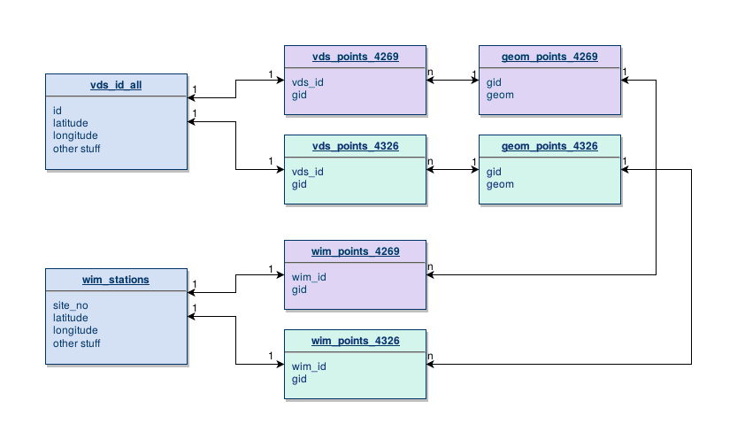


# Similar create/populate perl

* Parse the CSV metadata file
* For each detector
    * find or create entry in `wim_stations`
    * find or create entry in `geom_points_4269`
    * use PostGIS to transform geometry for `geom_points_4326`
    * make the join table entries


# Years go by

-----


-----


# The CalVAD project is ending

* Time to transfer results and data to customer
* Some database tables are way too big to download
* Many are manageable, but ...

# Re-run DB populate code

* Clean up, modernize, test old code
* Teach my ARB counterpart how to:
    * Load the required software
    * Download the data
    * Run the code
* "Learning by doing"


# First task, load the VDS detector metadata and data

* My DB had processed through 2012
* Customer downloaded 2013---2015 data and metadata
* I cleaned up [my perl code](https://github.com/jmarca/CalVAD-PEMS-StationsParse) (now using Dist::Zilla)
* I walked my counterpart through
    * Installing necessary system software
    * Installing PostgreSQL, PostGIS
    * Parsing and loading data

# Weeks pass

* Regular phone calls working through CalVAD code
* Updating old code
* Populating DB tables
* Processing data

# Then we get to the WIM data and metadata

* For WIM sites, about the same data now as in 2010
* I decided *not* to upgrade/modernize my WIM perl code
* I decided *instead* to just copy the WIM metadata to ARB


--------

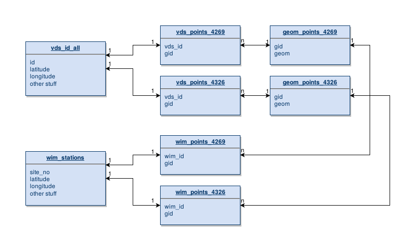


# Oops!


--------

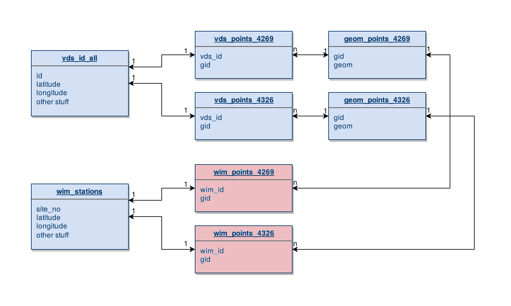


# I broke the join table

* We created new VDS points in the new DB
* The actual GID values are completely different
* But I copied the wim\_points\_xxx tables from my DB
* *with the wrong GID values*


# Fix this

* pgTAP
     * to prove there is a problem
     * to prove the fix worked
* Sqitch
     * to organize the fix

# pgTAP

* TAP = test anything protocol
* Lets you run tests in the database
* github: [https://github.com/theory/pgtap](https://github.com/theory/pgtap)
* docs: [http://pgtap.org](http://pgtap.org)

# What does it do?

> The basic purpose of pgTAP ... is to print out either\ "ok #" or
> "not ok #", depending on whether a given test succeeded or failed.

---from the README

# pgTAP basic usage

* As a simple test script, run with pg_prove
* In xUnit-style test functions that you install into your database
  and run all at once

# pgTAP basic usage

* As a simple test script, run with pg_prove
* ~~In xUnit-style test functions that you install into your database
  and run all at once~~


# pgTAP advanced features

* Can integrate with any TAP testing system
* TAP consumers exist in most languages
* xUnit-style usage
* compatible with continuous integration servers
    * Hudson, Travis etc


# I don't really know what that previous slide means


# My testing needs

1. Make sure the database tables exist
2. Verify primary keys
3. Make sure the tables reference each other
4. Make sure each WIM station has a geometry
4. Verify metadata (lat,lon) matches the linked geometry


# pg_prove

* http://search.cpan.org/dist/TAP-Parser-SourceHandler-pgTAP

```
cpanm --sudo TAP::Parser::SourceHandler::pgTAP
```

# cpanm?

```
cpan install App::cpanminus
```
... then later ...

```
cpanm -S --self-upgrade
```

# pgTAP


# Testing tables, schemas

* has_schema(),  has_table()
* schemas_are(), tables_are()

# The 'has_' test variants

* Check that something exists
* The test fails if that thing is not in the database
* For example

``` sqlpostgresql
SELECT has_table('public','wim_stations','there is a wim_stations table');
```

# The ‘_are' test variants

* Check that the DB contains exactly the list you specify
* Will fail if something is missing
* Will fail if something extra exists
* For example

``` sqlpostgresql
SELECT schemas_are(ARRAY[ 'public', 'wim','osm','vds','sqitch','pgRouting' ],
                   'expected schemas exist in database');
```

# Basic tests

``` sqlpostgresql
-- is there a wim_stations table?
SELECT has_table('public', 'wim_stations', 'there is a wim_stations table');

-- are  there join tables?
SELECT has_table('public', 'wim_points_4269', 'there is a wim_points_4269 table');
SELECT has_table('public', 'wim_points_4326', 'there is a wim_points_4326 table');

-- are there geometry tables?
SELECT has_table('public', 'geom_points_4269','there is a geom_points_4269 table');
SELECT has_table('public', 'geom_points_4326','there is a geom_points_4326 table');
```

# demo


# Testing table relationships

* col_is_pk(), has_pk()
* col_is_fk(), has_fk()
* indexes_are()


# Primary keys?


``` sqlpostgresql
SELECT col_is_pk('public', 'wim_stations', 'site_no', 'wim stations site_no is pk' );
SELECT col_is_pk('public', 'geom_points_4269','gid', 'geom points 4269 gid is pk' );
SELECT col_is_pk('public', 'geom_points_4326','gid', 'geom points 4326 gid is pk' );

SELECT col_is_pk('public', 'wim_points_4326','wim_id', 'geom points 4326 gid is pk' );
SELECT col_is_pk('public', 'wim_points_4269','wim_id', 'geom points 4269 gid is pk' );
```

# demo

# Indexes or Indices?

* use `indexes_are(:schema,:table,ARRAY[:indexes],:description)
* Don't forget the list of indices is an ARRAY

```sqlpostgresql
SELECT indexes_are('public', 'wim_stations',
                   ARRAY['wim_stations_pkey'],'wim_stations has index' );
SELECT indexes_are('public', 'geom_points_4269',
                   ARRAY['geom_points_4269_pkey','geom_points_4269_geom_index'],
                   'geom_points_4269 has index' );
```


# Testing foreign keys

* fk_ok() is a very cool function
* checks table to table relationships in one go


``` sqlpostgresql
SELECT fk_ok( :fk_schema,  :fk_table, :fk_columns,
              :pk_schema,  :pk_table, :pk_columns,
              :description );


```

--------

```{.sqlpostgresql .tall}
-- 4269
SELECT fk_ok(
    'public','wim_stations','site_no',
    'public','wim_points_4269','wim_id',
    'wim_points_4269 connects to wim_stations'
);

SELECT fk_ok(
    'public','geom_points_4269','gid',
    'public','wim_points_4269','gid',
    'wim_points_4269 connects to geom_points_4269'
);


-- 4326
SELECT fk_ok(
    'public','wim_stations','site_no',
    'public','wim_points_4326','wim_id',
    'wim_points_4326 connects to wim_stations'
);

SELECT fk_ok(
    'public','geom_points_4326','gid',
    'public','wim_points_4326','gid',
    'wim_points_4326 connects to geom_points_4326'
);
```

# demo  (should fail)


# Not limited to simple tests

```sqlpostgresql
SELECT results_eq(   A,      B,    :description );

SELECT results_eq( :sql,    :sql,    :description );
SELECT results_eq( :sql,    :array,  :description );
SELECT results_eq( :cursor, :cursor, :description );
SELECT results_eq( :sql,    :cursor, :description );
SELECT results_eq( :cursor, :sql,    :description );
SELECT results_eq( :cursor, :array,  :description );
```

results_eq() is a workhorse for my kind of problems.

# results_eq() Caveats

* Need to quote `:sql` arguments
    * so use `prepare` statements

* results_eq() does item by item comparison of A vs B
    * Be careful to order results explicitly


# Have enough entries?

``` sqlpostgresql
-- make sure join relations are all there
select results_eq(
    'select site_no from wim_stations order by site_no',
    'select wim_id from wim_points_4269 order by wim_id'
);

select results_eq(
    'select site_no from wim_stations order by site_no',
    'select wim_id from wim_points_4326 order by wim_id'
);
```

# demo


# Geometries vs metadata

```{.sqlpostgresql .tall}
-- do the geometries actually match the metadata in all cases?
PREPARE build_geoms_4269 AS
  SELECT ST_GeomFromEWKT('SRID=4269;POINT('||a.longitude||' '||a.latitude||')')
  FROM wim_stations a
  ORDER BY site_no;

PREPARE existing_geoms_4269 AS
  SELECT b.geom
  FROM wim_points_4269 a
  JOIN geom_points_4269 b USING (gid)
  ORDER BY wim_id;

-- expect that the metadata matches the stored 4269 geoms
SELECT results_eq(
    'build_geoms_4269',
    'existing_geoms_4269'
);
```

# Geometries vs metadata

```{.sqlpostgresql .tall}
-- now test projection
PREPARE projected_geoms_4269_to_4326 AS
  SELECT ST_TRANSFORM(b.geom,4326)
  FROM wim_points_4269 a
  JOIN geom_points_4269 b USING (gid)
  ORDER BY wim_id;

PREPARE existing_geoms_4326 AS
  SELECT b.geom
  FROM wim_points_4326 a
  JOIN geom_points_4326 b USING (gid)
  ORDER BY wim_id;


--expect that the transformed 4269 geoms matches the stored 4326 geoms
SELECT results_eq(
    'projected_geoms_4269_to_4326',
    'existing_geoms_4326'
);
```

# demo


# So, it is broken. How do I fix it?

# use Sqitch

(No 'u')

# What is Sqitch?

* Also by David Wheeler
* Docs: <http://sqitch.org/>
* Code: <https://github.com/theory/sqitch>
* A database change management application.
* Supports PostgreSQL 8.4+,
    * (also SQLite 3.7.11+, MySQL 5.0+, Oracle 10g+,
    Firebird 2.0+, and Vertica 6.0+.)


* Feels like:
    * git when you create and store changes to your plan
    * a package manager when you deploy, require dependencies, etc

# Sqitch documentation is great

Really.  Its superb.


# Sqitch "Hello World"

```bash
sqitch init calvad_wim_geometries --uri https://github.com/jmarca/calvad_wim_geometries --engine pg
createdb -U slash -h 127.0.0.1 brokendb
sqitch target add brokendb db:pg://slash@127.0.0.1/brokendb
sqitch engine add pg brokendb
sqitch add brooklyn  -m 'Hello Brooklyn!'
sqitch deploy
```

# Using sqitch to fix things

0. Make, populate a test "broken" database
1. Invoke `sqitch add` to generate scaffolding
2. Edit the deploy, verify, rollback, and test files
3. See if it works
4. Repeat steps 2 and 3


# Broken db

generated with mocha test script

```bash
./node_modules/.bin/mocha test/test_deploy.js --timeout 0
```

# Add a sqitch change

```
sqitch add fix_4269_geoms -m 'Fix metadata vs geom mismatch'

```

* Similar to a `git add ...`
* Generates
    * test/fix_4269_geoms.sql
    * deploy/fix_4269_geoms.sql
    * verify/fix_4269_geoms.sql
    * revert/fix_4269_geoms.sql


# Make a test using pgTAP

* sqitch has verify
* but not that useful here

# demo

------

```{.sqlpostgresql .tall}
SET client_min_messages TO warning;
CREATE EXTENSION IF NOT EXISTS pgtap;
RESET client_min_messages;

BEGIN;
SELECT no_plan();
-- SELECT plan(1);

SELECT pass('Test fix_4269_geoms!');

-- do the geometries actually match the metadata in all cases?
PREPARE build_geoms_4269 AS
  SELECT ST_GeomFromEWKT('SRID=4269;POINT('||a.longitude||' '||a.latitude||')')
  FROM wim_stations a
  ORDER BY site_no;

PREPARE existing_geoms_4269 AS
  SELECT b.geom
  FROM wim_points_4269 a
  JOIN geom_points_4269 b USING (gid)
  ORDER BY wim_id;

-- expect that the metadata matches the stored 4269 geoms
SELECT results_eq(
    'build_geoms_4269',
    'existing_geoms_4269'
);

SELECT finish();
ROLLBACK;
```

# deploy/fix_4269_geoms.sql

-------

```{.sqlpostgresql .tall}
BEGIN;
-- first, clear the decks
drop table  wim_points_4269;

-- recreate without any FK to geom_points
CREATE TABLE wim_points_4269 (
    gid integer NOT NULL,
    wim_id integer NOT NULL  primary key REFERENCES wim_stations (site_no)   ON DELETE CASCADE
);

-- get rid of gid relationship in geom_points
ALTER TABLE ONLY geom_points_4269
    DROP CONSTRAINT geom_points_4269_gid_fkey;
CREATE SEQUENCE geom_points_4269_gid_seq;
ALTER TABLE geom_points_4269
    ALTER COLUMN gid SET DEFAULT
    nextval('geom_points_4269_gid_seq');
ALTER SEQUENCE geom_points_4269_gid_seq OWNED BY geom_points_4269.gid;
SELECT setval('geom_points_4269_gid_seq',nextval('geom_ids_gid_seq'));

-- try to fix the broken geometries

-- create geoms holds geometries created from the metadata
WITH create_geoms AS (
  SELECT site_no, ST_GeomFromEWKT('SRID=4269;POINT('||a.longitude||' '||a.latitude||')') as geom
  FROM wim_stations a
  ORDER BY site_no
),

-- some of the geoms are likely repeated.  only make one
distinct_geoms AS (
  select distinct geom from create_geoms
),

-- Only keep those points that are not already in the
-- geom_points_4269 table
not_in_geoms_table AS (
  select a.geom
  from distinct_geoms a
  left outer join geom_points_4269 b on (a.geom=b.geom)
  where b.geom is null
),

-- insert the new geometries
inserted_geoms AS (
  INSERT INTO geom_points_4269 (geom)
  SELECT geom
  FROM not_in_geoms_table
    RETURNING geom,gid
),

-- combine both new and old for pairing off in join table
new_and_old as (
  select a.geom,a.gid
  from geom_points_4269 a
  join distinct_geoms b on (a.geom=b.geom)
  union
  select aa.geom,aa.gid
  from inserted_geoms aa
  join distinct_geoms b on (aa.geom=b.geom)
),

-- there is no guarantee that geometries in
-- geom_points_4269 are unique
-- so reduce new_and_old using DISTINCT
unique_set as (
  select distinct min(gid) as gid,geom
  from new_and_old
  group by geom
),

-- finally, join wim site numbers with the newly created gid values by
-- joining the tables on geom.  I expect multiple gids might occur
-- here.
wim_join_geoms AS (
  select a.site_no as wim_id,b.gid
  from create_geoms a
  join unique_set b ON(a.geom = b.geom)
)
INSERT INTO wim_points_4269 (wim_id,gid)
SELECT * FROM wim_join_geoms order by wim_id;

-- now that the geometries are paired off, reinstate the fk constraint
ALTER TABLE ONLY wim_points_4269
    ADD CONSTRAINT wim_points_4269_gid_fkey FOREIGN KEY (gid)
        REFERENCES geom_points_4269(gid)
    ON DELETE CASCADE;
```


# Deploy then test

```
sqitch deploy
pg_prove -d wim8_22_43 test/fix_4269_geoms.sql
```


# Now the projected geometry

# demo

# Client view

* I ship out the change as a git repo to the client
* He
    * clones it,
    * runs the test,
    * sqitch deploy
    * runs test again to verify fix

# demo

```
pg_prove -d wim15_51_59 test/fix_4269_geoms.sql test/fix_4326_geoms.sql
sqitch deploy --to fix_4269_geoms db:pg:wim15_51_59
pg_prove -d wim15_51_59 test/fix_4269_geoms.sql test/fix_4326_geoms.sql
sqitch deploy  db:pg:wim15_51_59
pg_prove -d wim15_51_59 test/fix_4269_geoms.sql test/fix_4326_geoms.sql
```


# Part 2: Modularize and test detector segmentation code

* This example is about cleaning that monstrous SQL hack
* Goal was to estimate segments "underneath" each loop detector
* But we had to use OpenStreetMap

# Sqitch to the rescue

* The biggest problem was the lack of clarity
* Using sqitch allowed us to organize each step of the process
* Worked in `verify` and `test` wherever needed
* `revert` scripts actually work to rollback changes

# Cross-project dependencies

* A sqitch change can depend on other changes
* Those changes can be in other projects

# calvad_db_geoextensions

```
%syntax-version=1.0.0
%project=calvad_db_geoextensions
%uri=https://github.com/jmarca/calvad_db_geoextensions

geoextensions 2016-04-10T15:38:22Z James E. Marca <james@activimetrics.com> # geoextensions
```
# detectors_schema

```
%syntax-version=1.0.0
%project=detectors_schema
%uri=https://github.com/jmarca/detectors_schema

newtbmap 2016-04-11T18:21:11Z James E. Marca <james@activimetrics.com> # newtbmap schema
```

# tvd

```
%syntax-version=1.0.0
%project=tvd
%uri=https://github.com/jmarca/tvd

tvd [detectors_schema:newtbmap calvad_db_geoextensions:geoextensions] 2016-04-11T18:13:29Z James E. Marca <james@activimetrics.com> # tvd table
populate_tvd [tvd] 2016-04-11T18:36:17Z James E. Marca <james@activimetrics.com> # populate tvd with initial data
```

# demo

Deploying tvd:tvd will fail unless dependencies are met

# Clean up task

* Pretty tedious
* Pick apart scripts into chunks
    * copying data
    * deploying OpenStreetMap
    * cleaning up route relations
    * etc
* Convert chunks into sqitch changes
    * clear dependencies on other packages
    * generally multiple changes per package
    * Write verify, test, revert sql
* Deploy each package to the database
* Verify and test with each deployed change

# Example

# Before

``` sqlpostgresql
DROP table if exists tempseg.relation_direction_geometries;

CREATE SEQUENCE tempseg_relation_direction_geometries_seq increment by 2;

SELECT rr.id as relation_id,sequence_id,linestring,
nextval('tempseg_relation_direction_geometries_seq') as ordering,
       CASE WHEN rr.direction = 'roles' THEN
            CASE WHEN m.member_role='' then 'any'
                 WHEN m.member_role is null then 'any'
                 --handle US:US 6, North&East, West&South
                 WHEN relation_id=337473 then
                      CASE WHEN m.member_role='east' then 'north'
                           WHEN m.member_role='west' then 'south'
                           ELSE m.member_role
                      END
                 ELSE m.member_role
            END
            WHEN rr.direction='' then 'any'
            WHEN rr.direction is null then 'any'
            ELSE rr.direction
       END as direction
into tempseg.relation_direction_geometries
FROM route_relations rr
JOIN relation_members AS m ON (rr.id=m.relation_id)
JOIN ways AS w ON ( member_id = w.id )
WHERE npoints(linestring) > 1  -- has to be a line or the st_collect breaks
-- and relation_id=69364
order by relation_id,direction,sequence_id;


-- first fix the directions of any to be all

drop table if exists tempseg.nother_table;
select rdg.relation_id,rdg.sequence_id,rdg.linestring,rdg.ordering,b.direction
into tempseg.nother_table
from tempseg.relation_direction_geometries rdg
join (select distinct relation_id,direction
      from tempseg.relation_direction_geometries d
      where direction != 'any') b on (b.relation_id=rdg.relation_id)
where rdg.direction='any';

-- Theoretically, that is every 'any' duplicated at most

-- need to make sure I handle lines that *only* have any direction?

-- then merge those

-- first the ones in 'nother_table

drop table if exists tempseg.initial_routelines cascade;
select relation_id,
       direction,
-- st_numGeometries(st_linemerge(st_collect(linestring)))
 st_linemerge(st_collect(linestring))
 as linestring
into tempseg.initial_routelines
from (
 select rdg.relation_id,
       rdg.direction,
       rdg.linestring,
       rdg.sequence_id
 from tempseg.relation_direction_geometries rdg
 where rdg.direction != 'any'
 UNION
 select n.relation_id,
       n.direction,
       n.linestring,
       n.sequence_id
 from tempseg.nother_table n
) q group by relation_id,direction;

--  now add the 'any' direction ones
insert into tempseg.initial_routelines
select relation_id,
       'both' as direction,
-- st_numGeometries(st_linemerge(st_collect(linestring)))
 st_linemerge(st_collect(linestring))
 as linestring
from (
 select rdg.relation_id,
       rdg.direction,
       rdg.linestring,
       rdg.sequence_id
 from tempseg.relation_direction_geometries rdg
 where rdg.direction = 'any' and
       rdg.relation_id not in (select distinct relation_id from tempseg.nother_table)
) a
group by relation_id, direction;

-- okay, now clean up those multilines


drop table if exists tempseg.route_relations_split_lines cascade;
CREATE TABLE  tempseg.route_relations_split_lines (
  relation_id bigint not null,
  direction text,
  id4 serial primary key,
  segment_id int not null
);
SELECT AddGeometryColumn( 'tempseg','route_relations_split_lines', 'routeline', 4326, 'LINESTRING', 2);

-- truncate tempseg.route_relations_split_lines;
insert into tempseg.route_relations_split_lines
 (relation_id,direction,segment_id,routeline)
SELECT
  relation_id,direction,generate_series(1,(Select ST_NumGeometries(linestring))*2,2) as segment_id,
ST_GeometryN(linestring, generate_series(1, ST_NumGeometries(linestring))) AS routeline
FROM tempseg.initial_routelines
where ST_NumGeometries(linestring) is not null
-- and  relation_id = 70350
order by relation_id,direction
;

--  select distinct relation_id from tempseg.route_relations_split_lines order by relation_id;
--  relation_id
-- -------------
-- --        70350
-- --       74660
-- -- skipping       74885
-- --       76279

-- I did those above 4 on OSM, and all of them were off ramps attached
-- to the main relation, or wrong way segments.  So try this...just
-- drop all short segments

-- select relation_id,direction,segment_id,
--  st_length_Spheroid(
--      routeline,
--      'SPHEROID["GRS_1980",6378137,298.257222101]') as llength
-- from tempseg.route_relations_split_lines
-- where relation_id in  (70350, 74660, 74885, 76279)
-- order by relation_id,direction,llength;

-- so, first try getting rid of lines under 500 meters

drop table if exists tempseg.fixed_relations;

select relation_id,direction
into tempseg.fixed_relations
from (
select GeometryType(st_linemerge(st_collect(routeline))) as geomtype,relation_id,direction from tempseg.route_relations_split_lines
group by relation_id,direction
order by geomtype
)a where geomtype = 'LINESTRING';

-- manually ratchet up the length from 100 to 1000, I guess


delete from tempseg.route_relations_split_lines
where
(st_length_Spheroid(
     routeline,
     'SPHEROID["GRS_1980",6378137,298.257222101]')) < 200
;

insert into tempseg.fixed_relations (relation_id,direction)
select relation_id,direction
from (
  select GeometryType(
          st_linemerge(st_collect(routeline))) as geomtype,
         relation_id,direction
  from tempseg.route_relations_split_lines
  left outer join tempseg.fixed_relations q using(relation_id,direction) where q.relation_id is null
  group by relation_id,direction
  order by geomtype
)a where geomtype = 'LINESTRING';

delete from tempseg.route_relations_split_lines
where
(st_length_Spheroid(
     routeline,
     'SPHEROID["GRS_1980",6378137,298.257222101]')) < 400
;

insert into tempseg.fixed_relations (relation_id,direction)
select relation_id,direction
from (
  select GeometryType(
          st_linemerge(st_collect(routeline))) as geomtype,
         relation_id,direction
  from tempseg.route_relations_split_lines
  left outer join tempseg.fixed_relations q using(relation_id,direction) where q.relation_id is null
  group by relation_id,direction
  order by geomtype
)a where geomtype = 'LINESTRING';

delete from tempseg.route_relations_split_lines
where
(st_length_Spheroid(
     routeline,
     'SPHEROID["GRS_1980",6378137,298.257222101]')) < 600
;

insert into tempseg.fixed_relations (relation_id,direction)
select relation_id,direction
from (
  select GeometryType(
          st_linemerge(st_collect(routeline))) as geomtype,
         relation_id,direction
  from tempseg.route_relations_split_lines
  left outer join tempseg.fixed_relations q using(relation_id,direction) where q.relation_id is null
  group by relation_id,direction
  order by geomtype
)a where geomtype = 'LINESTRING';

delete from tempseg.route_relations_split_lines
where
(st_length_Spheroid(
     routeline,
     'SPHEROID["GRS_1980",6378137,298.257222101]')) < 800
;

insert into tempseg.fixed_relations (relation_id,direction)
select relation_id,direction
from (
  select GeometryType(
          st_linemerge(st_collect(routeline))) as geomtype,
         relation_id,direction
  from tempseg.route_relations_split_lines
  left outer join tempseg.fixed_relations q using(relation_id,direction) where q.relation_id is null
  group by relation_id,direction
  order by geomtype
)a where geomtype = 'LINESTRING';

-- select GeometryType(st_linemerge(st_collect(routeline))) as geomtype,relation_id,direction from tempseg.route_relations_split_lines
-- left outer join tempseg.fixed_relations q using(relation_id,direction) where q.relation_id is null
-- and id4 not in
-- ( select id4
--   from tempseg.route_relations_split_lines
--   where  (st_length_Spheroid(
--      routeline,
--      'SPHEROID["GRS_1980",6378137,298.257222101]')) < 900
-- )
-- group by relation_id,direction
-- order by geomtype;


-- okay, that has pretty much run out of its usefulness.  Now I need
-- to insert segments as needed.  My thought is for those geoms with
-- two or three parts, make segments to join the parts, if that
-- segment is less than 1km

-- how?

-- select geometry 1 of N, last point, join with first point, geometry 2 of N

-- so make a new temp table

drop table if exists tempseg.more_split_lines cascade;
CREATE TABLE  tempseg.more_split_lines (
  relation_id bigint not null,
  direction text,
  id4 serial primary key,
  fix boolean default false,
  segment_id int not null
);
SELECT AddGeometryColumn( 'tempseg','more_split_lines', 'routeline', 4326, 'LINESTRING', 2);


insert into tempseg.more_split_lines
 (relation_id,direction,segment_id,routeline)
SELECT
  relation_id,direction,generate_series(1,(Select ST_NumGeometries(linestring))*2,2) as segment_id,
ST_GeometryN(linestring, generate_series(1, ST_NumGeometries(linestring))) AS routeline
from (
  select st_linemerge(st_collect(routeline)) as linestring,
         relation_id,direction
  from tempseg.route_relations_split_lines
  left outer join tempseg.fixed_relations q using(relation_id,direction)
  where q.relation_id is null
  group by relation_id,direction
) b
where ST_NumGeometries(linestring) is not null;


-- self join, construct joining segments

insert into tempseg.more_split_lines
  (relation_id, direction, segment_id, fix,routeline)
  select rl1.relation_id, rl1.direction,rl1.segment_id + 1 as segment_id,
       true as fix,
       st_makeline(
             st_endpoint(rl1.routeline),
             st_startpoint(rl2.routeline)
       ) as routeline
  from tempseg.more_split_lines rl1
  join tempseg.more_split_lines rl2
       on (rl1.relation_id=rl2.relation_id
           and rl1.direction = rl2.direction
           and rl1.segment_id + 2 = rl2.segment_id
          )
  where not ST_equals(st_endpoint(rl1.routeline),
             st_startpoint(rl2.routeline))
  and ST_Distance_Sphere(st_endpoint(rl1.routeline),
             st_startpoint(rl2.routeline)) < 1000
;

-- select  GeometryType(st_linemerge(st_collect(routeline))) as geomtype,
--        relation_id,direction
-- from tempseg.more_split_lines
-- group by relation_id,direction
-- order by geomtype;

-- Okay, that is as good as I can get for now

drop table if exists tempseg.revised_route_lines cascade;
CREATE TABLE  tempseg.revised_route_lines (
  relation_id bigint not null,
  direction text,
  id4 serial primary key,
  unique (relation_id,direction)
);
SELECT AddGeometryColumn( 'tempseg','revised_route_lines', 'routeline', 4326, 'GEOMETRY', 2);


insert into tempseg.revised_route_lines
(routeline,relation_id,direction)
select  st_linemerge(st_collect(routeline)),
       relation_id,direction
from tempseg.more_split_lines
group by relation_id,direction;

insert into tempseg.revised_route_lines
(routeline,relation_id,direction)
select st_linemerge(st_collect(routeline)),
       relation_id,direction
from tempseg.route_relations_split_lines
join tempseg.fixed_relations q using(relation_id,direction)
group by relation_id,direction;


insert into tempseg.revised_route_lines
(routeline,relation_id,direction)
select linestring,relation_id,direction
from tempseg.initial_routelines
where geometrytype(linestring)='LINESTRING';
```
# After

# revised_route_lines/sqitch.plan

```
%syntax-version=1.0.0
%project=revised_route_lines
%uri=https://github.com/jmarca/revised_route_lines

tempseg_schema 2016-04-14T23:38:28Z James E. Marca <james@activimetrics.com> # schema for temp segment work
rdg_seq [osm_via_osmosis:route_relations] 2016-04-14T23:24:30Z James E. Marca <james@activimetrics.com> # sequence for relation direction geometries table
rdg [tempseg_schema rdg_seq] 2016-04-14T23:44:06Z James E. Marca <james@activimetrics.com> # relation-direction-geometries utility table
initial_routelines [tempseg_schema rdg] 2016-04-15T00:00:11Z James E. Marca <james@activimetrics.com> # initial_routelines utility table
split_lines [initial_routelines] 2016-04-15T05:01:17Z James E. Marca <james@activimetrics.com> # first split lines table
fixed_relations [split_lines] 2016-04-15T05:22:29Z James E. Marca <james@activimetrics.com> # fixed split relations
more_splits [fixed_relations split_lines] 2016-04-15T06:28:42Z James E. Marca <james@activimetrics.com> # more split lines working table
rsl [more_splits fixed_relations split_lines] 2016-04-15T06:43:41Z James E. Marca <james@activimetrics.com> # revised route lines
```

# revised_route_lines/deploy/rsl

```sqlpostgresql
-- Deploy revised_route_lines:rsl to pg
-- requires: more_splits
-- requires: fixed_relations
-- requires: split_lines

BEGIN;

CREATE TABLE  tempseg.revised_route_lines (
  relation_id bigint not null,
  direction text,
  id4 serial primary key,
  unique (relation_id,direction)
);
SELECT AddGeometryColumn( 'tempseg','revised_route_lines', 'routeline',
                          4326, 'GEOMETRY', 2);

INSERT INTO tempseg.revised_route_lines
            (routeline,relation_id,direction)
SELECT
        ST_linemerge(ST_collect(routeline)),
        relation_id,direction
FROM tempseg.more_split_lines
GROUP BY relation_id,direction;

INSERT INTO tempseg.revised_route_lines
            (routeline,relation_id,direction)
SELECT ST_linemerge(ST_collect(routeline)),
       relation_id,direction
FROM tempseg.route_relations_split_lines
JOIN tempseg.fixed_relations q USING(relation_id,direction)
GROUP BY relation_id,direction;


INSERT INTO tempseg.revised_route_lines
            (routeline,relation_id,direction)
SELECT linestring,relation_id,direction
FROM tempseg.initial_routelines
LEFT OUTER JOIN tempseg.revised_route_lines rrl using(relation_id,direction)
WHERE geometrytype(linestring)='LINESTRING'
AND rrl.relation_id IS NULL;

COMMIT;
```
# Example test

```sqlpostgresql
PREPARE tallyup AS
   SELECT count(*)::integer
   FROM tempseg.route_relations_split_lines;

PREPARE this_or_that AS
   SELECT CASE
            WHEN exists(SELECT tablename
                        FROM pg_tables
                        WHERE schemaname='tempseg'
                          AND tablename='fixed_relations')
            THEN 1884
            ELSE 2799
            END;

SELECT results_eq('tallyup', 'this_or_that',
                  'The data got loaded okay');
```

# Sqitch and pgTAP are great

# "Itches"

1. verify != test
    * I want to put pgTAP tests into the verify scripts
    * Instead, need to write SQL that will fail
2. Dependencies are checked at deploy time
3. Can't automatically deploy dependencies

------


# My plans

* npm run-scripts to deploy, verify, test
* npm run-scripts to fetch dependencies
* npm run-scripts to deploy dependencies
* stop using mocha; switch to node-tap

# Thank you
